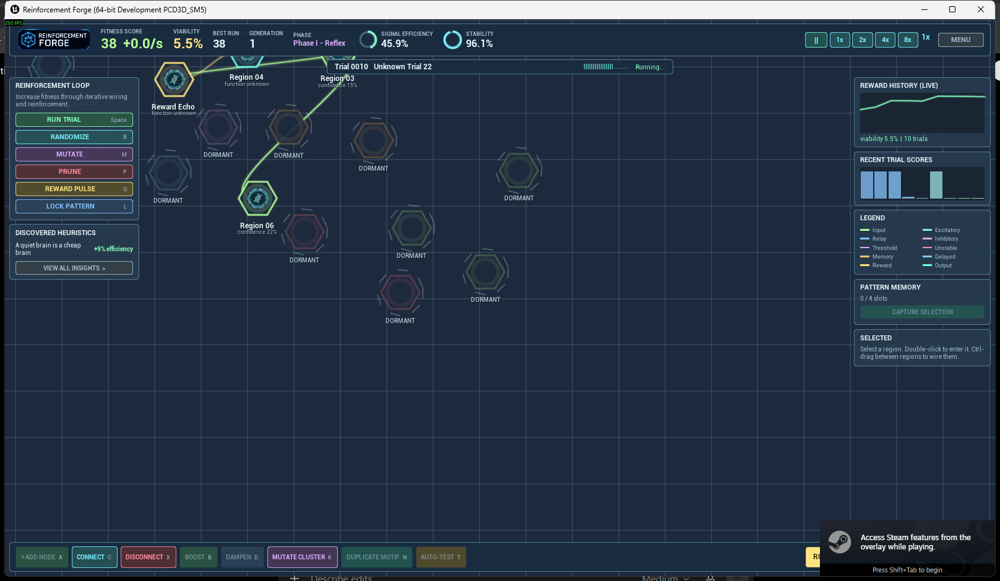

# Reinforcement Forge

**Grow a human mind from noise.**

Reinforcement Forge is a calm, neon strategy-sim about constructing a human brain
through nested neural networks. You never control a person - you create, mutate,
reinforce, prune, and connect neural structures until, blindly, they produce
human behavior. You start with no idea what any signal means. You are performing
blind evolution.

Built with **Unreal Engine 5.8** (C++ / Slate). All UI, node rendering, connection
glow, pulses, and electric effects are procedural. All sound effects and the
adaptive score are synthesized in-engine at startup - the music grows more
musical and coherent as your brain's fitness rises.



## The loop (if Mini Motorways were about neurons)

- Trials stream continuously - compressed life scenarios ("Unknown Trial 07")
  that feed hidden sensory channels and score the hidden agent's behavior.
- You reshape the network while it runs: wire regions, mutate, prune weak paths,
  send reward pulses, lock what works.
- Every 25 trials is a **Generation**: pick one of three adaptations
  (energy reserve, pattern slot, insight probe, stability bath...).
- Rising fitness unlocks developmental phases - Reflex, Perception, Memory,
  Social, Language, Cognition - and dormant brain regions can awaken.
- Reach 100% viability and the blind experiment opens its eyes.

## Key systems

| System | Where |
| --- | --- |
| Symbolic neural sim (thresholds, decay, noise, delays, plasticity) | `Source/BrainForge/Core/NeuralNetwork.*` |
| 15 nested brain regions with LOD compilation | `Source/BrainForge/Core/BrainGraph.*` |
| Hidden agent + 12 trial scenarios | `Source/BrainForge/Core/TrialSystem.*` |
| Geometric-mean multi-dimensional fitness | `Source/BrainForge/Core/TrialSystem.*` |
| Weighted mutation engine with fuzzy previews | `Source/BrainForge/Core/MutationEngine.*` |
| Discovery: region confidence, heuristics with real bonuses | `Source/BrainForge/Core/DiscoverySystem.*` |
| Pattern memory (capture / stamp motifs) | `Source/BrainForge/Core/PatternLibrary.*` |
| Session flow: energy economy, generations, phases, victory | `Source/BrainForge/Core/ForgeSession.*` |
| Procedural audio + generative adaptive score | `Source/BrainForge/Core/ForgeAudio.*` |
| Procedural graph canvas (bezier glow, pulses, jitter) | `Source/BrainForge/UI/SGraphCanvas.*` |
| JSON lineage saves with branching | `Source/BrainForge/Core/SaveSystem.*` |

## Controls

| Input | Action |
| --- | --- |
| Left-drag empty space / RMB / MMB | Pan |
| Mouse wheel | Zoom |
| Click / drag node | Select / move |
| Ctrl-drag node to node | Wire a connection |
| Double-click region | Enter subnetwork (or awaken a dormant one) |
| Space | Run trials |
| R / M / K / P / Q / L | Randomize / Mutate / Mutate cluster / Prune / Reward pulse / Lock |
| C / X / B / D / T / N | Connect / Cut / Boost / Dampen / Auto-test / Duplicate motif |
| 0 1 2 3 4 | Pause, 1x, 2x, 4x, 8x |
| F | Re-center view |
| Esc | Back / menu |

## Building

Requirements: Unreal Engine 5.8, Visual Studio 2022 with C++ workload.

```
Engine\Build\BatchFiles\Build.bat BrainForge Win64 Development -Project="<path>\BrainForge.uproject"
```

Run: `UnrealEditor.exe BrainForge.uproject -game`
(add `-forgeautostart=<seed>` to skip the menu).

Package: see `Tools/PackageGame.ps1` or `docs/STEAM.md`.

## Steam

Steam packaging notes, store checklist and depot layout: [docs/STEAM.md](docs/STEAM.md).

---

(c) 2026 Bull Axiom. All rights reserved.
